# LuminaVista OS — Graphify Architecture & System Dependency Topology

## Overview
**LuminaVista OS** is a sovereign cloud operating system, Firecracker POSIX microVM execution platform, and multi-key autonomous AI engineering studio. 

The **Graphify Graph** visualizer is embedded natively within the AI Studio as a dedicated sub-tab (`[ 📊 Graphify Graph ]`), providing interactive force-directed graph inspection of the entire codebase, serverless API mesh, runtime sandboxes, security perimeters, and mounted user Virtual File System (VFS) artifacts.

---

## Architectural Topology Diagram

```mermaid
flowchart TD
    subgraph Client["Frontend Desktop & Workspaces (Browser Client)"]
        DASH["dashboard.html<br/>(Master Workspace Desktop)"]
        LAND["index.html<br/>(Landing & Marketing Showcase)"]
        SIDEBAR_MOD["sidebar.js<br/>(Off-Canvas Navigation Drawer)"]
        SYS_MOD["system.js<br/>(Command Palette & Locks)"]
        STATE_MOD["state.js<br/>(Reactive State Bus)"]
        
        subgraph SubTabs["AI Studio Sub-Tabs"]
            AI_CHAT["💬 Chat View<br/>(Multi-Session & Thinking Stream)"]
            AI_CS["📁 Artifacts & Files IDE<br/>(Editor, Preview, Terminal, Tree)"]
            AI_GRAPH["📊 Graphify Graph<br/>(Interactive Force Visualizer)"]
        end

        subgraph Modules["Client Feature Modules (< 2,000 LOC Modular Architecture)"]
            AI_MOD["ai-studio.js<br/>(Core Orchestrator & Jev Intent)"]
            AI_SIM["ai-simulation.js<br/>(Offline Simulation & Tasks)"]
            AI_TS["ai-tasks-sessions.js<br/>(Sessions & Cron Daemon)"]
            AI_UI["ai-chat-ui.js<br/>(Chat UI & Thinking Orbs)"]
            CAL_MOD["calendar.js<br/>(Google Cal Sovereign Replica)"]
            CAL_SYNC["calendar-sync.js<br/>(OAuth Sync & iCal Engine)"]
            CS_MOD["codespace.js<br/>(VFS Manager & Runner)"]
            GRAPH_MOD["graphify.js<br/>(Canvas Simulation Engine)"]
            WB_MOD["whiteboard.js<br/>(Whiteboard Pro Canvas)"]
            NOTES_MOD["notes.js<br/>(Markdown Split Vault)"]
            PROJ_MOD["projects.js<br/>(Viewport Frame Switcher)"]
            COMP_MOD["compiler.js<br/>(Multi-Lang Code Runner)"]
            TERM_MOD["terminal.js<br/>(MicroVM Shell Client)"]
            TEL_MOD["telemetry-theme.js<br/>(Audio Waveforms & Theme)"]
            VOICE_MOD["voice-studio.js<br/>(Sovereign Voice Studio)"]
        end

        VFS[("Virtual File System (VFS)<br/>window.vfs / LocalStorage")]
    end

    subgraph Security["Edge Security & Auth Layer"]
        MID["middleware.js<br/>(Edge Security & Routing)"]
        AUTH_API["api/auth.js<br/>(Zero-Trust PIN Login)"]
        LOGOUT_API["api/logout.js<br/>(Session Revocation)"]
        GUARD["api/_lib/auth-guard.js<br/>(Session & Rate Limiting)"]
        REDIS_LIB["api/_lib/redis.js<br/>(Upstash REST Client)"]
    end

    subgraph Serverless["Edge & Serverless API Mesh (Vercel Node.js 20)"]
        JEV["api/_lib/jev-engine.js<br/>(TypeSafe Jev S1 Intent Layer)"]
        POOL["api/_lib/key-pool.js<br/>(8x Ollama + NVIDIA Failover)"]

        API_CHAT["api/chat.js<br/>(Autonomous Agent Loop)"]
        API_CAL["api/calendar.js<br/>(Google Cal Sync Controller)"]
        API_TERM["api/terminal.js<br/>(MicroVM Exec)"]
        API_COMP["api/compile.js<br/>(Cloud Compiler)"]
        API_SYNC["api/sync.js<br/>(Workspace Sync)"]
        API_STORE["api/storage.js<br/>(Directory-Safe Vault)"]
        API_WORK["api/worker.js<br/>(Cron Scheduled Runner)"]
    end

    subgraph Sandboxes["Cloud Sandboxes & External Gateways"]
        E2B["E2B Firecracker MicroVM<br/>(POSIX Linux: Node 20, Python 3.11)"]
        OLLAMA["Ollama Cloud Pool (8x Keys)<br/>(Llama 3.3 70B, Qwen, DeepSeek)"]
        NVIDIA["NVIDIA NIM Gateway<br/>(Enterprise Accelerated Compute)"]
        GCAL["Google Calendar API<br/>(Two-Way OAuth2 Sync)"]
        UPSTASH[("Upstash Redis Cloud<br/>(Session Tokens & Rate Limits)")]
    end

    %% Client Connections
    DASH --> SubTabs
    DASH --> SIDEBAR_MOD
    DASH --> SYS_MOD
    DASH --> STATE_MOD
    DASH --> MID
    SubTabs --> AI_MOD
    AI_MOD --> AI_SIM
    AI_MOD --> AI_TS
    AI_MOD --> AI_UI
    AI_TS --> CAL_MOD
    AI_TS --> API_WORK
    AI_MOD --> CS_MOD
    AI_MOD --> GRAPH_MOD
    AI_MOD --> CAL_MOD
    AI_MOD --> VOICE_MOD
    DASH --> WB_MOD
    DASH --> NOTES_MOD
    DASH --> PROJ_MOD
    DASH --> COMP_MOD
    DASH --> TERM_MOD
    DASH --> TEL_MOD
    DASH --> CAL_MOD
    DASH --> CAL_SYNC
    DASH --> VOICE_MOD

    CAL_MOD --> CAL_SYNC

    AI_MOD --> VFS
    CS_MOD --> VFS
    GRAPH_MOD -.-> VFS

    %% API Connections
    AI_MOD -->|POST /api/chat| API_CHAT
    CAL_MOD -->|Local Directives| CAL_SYNC
    CAL_SYNC -->|OAuth & Sync| API_CAL
    CAL_MOD -->|Sync Delegate| API_CAL
    CS_MOD -->|POST /api/terminal| API_TERM
    COMP_MOD -->|POST /api/compile| API_COMP
    SYS_MOD -->|POST /api/sync| API_SYNC
    API_WORK -->|Task Sync| API_CAL

    %% Guard Connections
    MID --> GUARD
    AUTH_API --> GUARD
    LOGOUT_API --> GUARD
    AUTH_API --> REDIS_LIB
    API_CHAT --> GUARD
    API_TERM --> GUARD
    API_COMP --> GUARD
    API_SYNC --> GUARD
    GUARD --> REDIS_LIB
    REDIS_LIB --> UPSTASH

    %% Backend Inference & MicroVM
    API_CHAT --> JEV
    API_CHAT --> POOL
    POOL --> OLLAMA
    POOL --> NVIDIA
    API_CHAT --> E2B
    API_TERM --> E2B
    API_CAL --> GCAL
```

---

## Component Matrix & Node Classifications

| Node ID | Classification | Est. LOC | Size | Role & Architectural Responsibilities |
| :--- | :--- | :--- | :--- | :--- |
| `dashboard.html` | Frontend Core | 1,530 | 84 KB | Master OS desktop container, top system bar, command palette, and tabbed workspace manager. |
| `index.html` | Frontend Core | 420 | 36 KB | Marketing landing page showcasing live desktop previews and quick launch. |
| `modules/sidebar.js` | Frontend Core | 320 | 14 KB | Responsive off-canvas sidebar drawer, workspace switcher, and mobile drawer controls. |
| `modules/system.js` | Frontend Core | 430 | 15 KB | Command Palette (`⌘K`), session inactivity timer, PIN lock screen, and system clock. |
| `modules/state.js` | Frontend Core | 210 | 9 KB | Central reactive state store, active tab routing, and session state persistence. |
| `modules/ai-studio.js` | AI & Inference | 1,363 | 64 KB | Autonomous AI Studio core orchestrator, Jev intent classifier, provider settings, and tool execution protocol. |
| `modules/ai-simulation.js` | AI & Inference | 1,225 | 58 KB | Client-side autonomous agent simulation sandbox, chaos engineering drill generator, and offline tool execution. |
| `modules/ai-tasks-sessions.js` | AI & Inference | 550 | 24 KB | Multi-session conversation history, scheduled autonomous background tasks, and cloud worker synchronization. |
| `modules/ai-chat-ui.js` | AI & Inference | 758 | 39 KB | Thinking Orbs animated state engine, Claude/Antigravity collapsible thought cards, action cards, prompt edit, and chat rendering. |
| `personas.js` | AI & Inference | 1,384 | 68 KB | 1,800+ specialized technical persona directives categorized across 35 engineering disciplines. |
| `api/_lib/key-pool.js` | AI Infrastructure | 200 | 8 KB | 8x Ollama Cloud & NVIDIA NIM multi-key pool with automated 429 rate-limit failover. |
| `api/_lib/jev-engine.js` | AI Infrastructure | 710 | 37 KB | TypeSafe Jev System-1 sub-50ms intent classifier, safety guardrails, dynamic cognitive synthesis, and calendar directives. |
| `api/chat.js` | Serverless APIs | 410 | 17 KB | Autonomous serverless agent loop with multi-key cloud failover, tool calling, and live VFS injection. |
| `api/calendar.js` | Serverless APIs | 370 | 14 KB | Consolidated Google Calendar OAuth2 flow, webhook handlers, and two-way synchronization controller. |
| `api/terminal.js` | Serverless APIs | 180 | 7 KB | E2B Firecracker POSIX microVM execution endpoint with command timeout guards. |
| `api/compile.js` | Serverless APIs | 160 | 6 KB | Multi-language compiler gateway routing to cloud execution sandboxes. |
| `api/sync.js` | Serverless APIs | 140 | 5 KB | Encrypted remote workspace synchronization with zero-trust session validation. |
| `api/storage.js` | Serverless APIs | 150 | 6 KB | Directory-traversal protected persistent file storage vault. |
| `api/worker.js` | Serverless APIs | 190 | 8 KB | Autonomous scheduled task runner and heartbeat cron worker. |
| `middleware.js` | Security & Auth | 90 | 4 KB | Edge runtime security headers, CSP policies, and zero-trust session validation. |
| `api/auth.js` | Security & Auth | 110 | 5 KB | Cryptographic PIN authentication, session token generation, and secure cookie issuance. |
| `api/logout.js` | Security & Auth | 40 | 2 KB | Zero-trust session revocation, cookie scrubbing, and cache clearing. |
| `api/_lib/auth-guard.js` | Security & Auth | 130 | 5 KB | Zero-trust session authorization, sliding IP rate limiting, and credential fragment sanitization. |
| `api/_lib/redis.js` | Security & Auth | 20 | 1 KB | Upstash Redis REST client initialization with graceful offline degradation. |
| `modules/calendar.js` | Workspaces | 1,615 | 68 KB | Google Calendar sovereign replica with 6 calendar views, AI auto-planning, conflict resolution, and event modals. |
| `modules/calendar-sync.js` | Workspaces | 650 | 25 KB | Google Calendar two-way OAuth2 synchronization controller, status badge, modal, and RFC 5545 iCalendar import/export. |
| `modules/codespace.js` | Workspaces | 850 | 36 KB | Sovereign Artifact Codespace, Monaco/textarea editor, live preview frame, VFS tree manager, and embedded terminal. |
| `modules/whiteboard.js` | Workspaces | 560 | 24 KB | Whiteboard Pro vector drawing canvas with touchscreen pointer events, dual-canvas preview, and sticky notes. |
| `modules/notes.js` | Workspaces | 420 | 18 KB | Multi-document Markdown notes vault with split real-time HTML preview and task checklists. |
| `modules/projects.js` | Workspaces | 310 | 13 KB | Interactive projects directory with multi-device viewport frame switcher (Desktop, Tablet, Mobile). |
| `modules/compiler.js` | Workspaces | 380 | 15 KB | Zero-downtime multi-language code runner supporting Python, C++, Java, and Bash. |
| `modules/telemetry-theme.js` | Workspaces | 240 | 10 KB | Real-time Web Audio API waveform visualizer and 4-tier cyber theme switcher (Cyan, Emerald, Amber, Rose). |
| `modules/terminal.js` | Workspaces | 290 | 12 KB | Interactive terminal emulator connected to Firecracker POSIX microVM endpoint. |
| `modules/voice-studio.js` | Workspaces | 480 | 20 KB | 100% Free Sovereign Voice Studio with Web Speech recognition, audio visualizer, and speech synthesis. |
| `modules/graphify.js` | Workspaces | 660 | 29 KB | Dynamic project architecture and dependency graph visualizer. |
| `tests/features.test.cjs` | Testing & QA | 600 | 30 KB | 240+ assertion comprehensive test suite covering DOM, sandboxes, tools, calendar, and security. |
| `tests/browser-cdp-test.cjs` | Testing & QA | 220 | 11 KB | Headless Google Chrome automation testing via DevTools Protocol (CDP). |
| `VFS` | Runtimes | N/A | In-Memory | Client-side virtual file system mounted at `window.vfs` with localStorage persistence. |
| `E2B MicroVM` | Runtimes | N/A | POSIX Cloud | Isolated Firecracker microVM executing Node.js 20, Python 3.11, and Bash. |
| `Ollama Cloud 8x` | Runtimes | N/A | Cloud Inference | 8-Key pooled cloud inference gateway supporting Llama 3.3 70B, DeepSeek, and Qwen. |
| `NVIDIA NIM Pool` | Runtimes | N/A | Cloud Inference | High-throughput enterprise AI gateway hosted on NVIDIA accelerated compute. |
| `Google Calendar API` | Runtimes | N/A | Cloud Calendar | Google Calendar API v3 primary calendar endpoint for real-time two-way synchronization. |

---

## AI Studio Sub-Tabs Workflow

1. **Chat Sub-Tab (`[ 💬 Chat ]`)**:
   - Maximized chat stream with multi-session history, scheduled tasks daemon, and prompt bar.
   - Claude/Antigravity-style live collapsible thought process banner:
     `Formulating Cognitive Architecture & Verifying MicroVM Playbooks...`
   - Real-world natural conversational capabilities for greetings, identity, cooking recipes, and system inquiries without repetitive canned templates.
   - Tool directives rendered as sleek, compact action cards. **Files created do not flood the chat with code blocks**; instead, they display an `Open in Artifacts Tab` button.

2. **Artifacts & Files Sub-Tab (`[ 📁 Artifacts & Files ]`)**:
   - Full-width sovereign IDE taking 100% of available viewport real estate.
   - Multi-tab file manager, collapsible Explorer tree, and VFS file count badge.
   - 4-way view mode switcher: `Preview`, `Code`, `Terminal`, `Split`.
   - MicroVM command execution bar and `Run` button with instant reload.

3. **Graphify Graph Sub-Tab (`[ 📊 Graphify Graph ]`)**:
   - Real-time Canvas force simulation mapping all project components and user VFS files.
   - Category filtering: `All`, `Frontend`, `AI Engine`, `APIs`, `Security`, `Sandboxes`, `VFS Files`.
   - Node search, zoom in/out, pan, and view reset.
   - Node Inspector Drawer displaying LOC, file size, dependencies, incoming/outgoing links, and direct jump to Artifacts IDE for VFS artifacts.
   - Export high-resolution architecture diagram as PNG or complete topology manifest as JSON.
