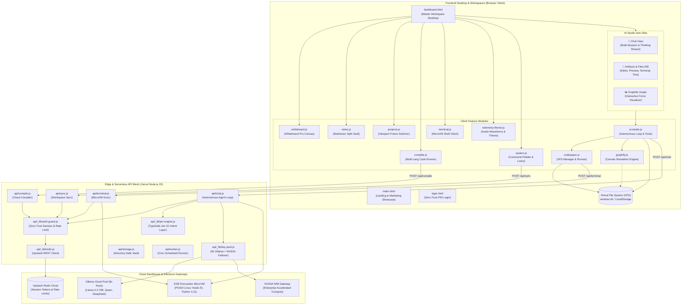

# LuminaVista OS — Graphify Architecture & System Dependency Topology

## Overview
**LuminaVista OS** is a sovereign cloud operating system, Firecracker POSIX microVM execution platform, and multi-key autonomous AI engineering studio. 

The **Graphify Graph** visualizer is embedded natively within the AI Studio as a dedicated sub-tab (`[ 📊 Graphify Graph ]`), providing interactive force-directed graph inspection of the entire codebase, serverless API mesh, runtime sandboxes, security perimeters, and mounted user Virtual File System (VFS) artifacts.

---

## Architectural Topology Diagram

---

## Component Matrix & Node Classifications

| Node ID | Classification | Est. LOC | Size | Role & Architectural Responsibilities |
| :--- | :--- | :--- | :--- | :--- |
| `dashboard.html` | Frontend Core | 1,055 | 92 KB | Master OS desktop container, top system bar, command palette, and tabbed workspace manager. |
| `index.html` | Frontend Core | 420 | 46 KB | Marketing landing page showcasing live desktop previews and quick launch. |
| `login.html` | Frontend Core | 210 | 18 KB | Zero-trust cryptographic PIN login interface with session auto-lock. |
| `modules/ai-studio.js` | AI & Inference | 1,980 | 89 KB | Autonomous agent loop, thinking engine (`Formulating Cognitive Architecture...`), scheduled tasks daemon, sub-tab navigation, and tool execution. |
| `personas.js` | AI & Inference | 3,600 | 1.3 MB | 1,800 specialized technical persona directives categorized across 35 engineering disciplines. |
| `modules/graphify.js` | AI & Workspaces | 520 | 24 KB | Interactive canvas-based force-directed architecture visualizer with real-time VFS mapping, pan/zoom, filters, and PNG/JSON export. |
| `modules/codespace.js` | Workspaces | 420 | 18 KB | Sovereign Artifact Codespace, Monaco/textarea editor, live iframe preview frame, VFS tree manager, and embedded terminal. |
| `modules/whiteboard.js` | Workspaces | 560 | 24 KB | Whiteboard Pro vector drawing canvas with dual-layer preview, shape generators, and sticky notes. |
| `modules/notes.js` | Workspaces | 420 | 18 KB | Multi-document Markdown notes vault with split real-time HTML preview and task checklists. |
| `modules/projects.js` | Workspaces | 310 | 13 KB | Interactive projects directory with multi-device viewport frame switcher (Desktop, Tablet, Mobile). |
| `modules/compiler.js` | Workspaces | 380 | 15 KB | Zero-downtime multi-language code runner supporting Python, C++, Java, and Bash. |
| `modules/terminal.js` | Workspaces | 290 | 12 KB | Interactive terminal emulator connected to Firecracker POSIX microVM endpoint. |
| `modules/telemetry-theme.js` | Workspaces | 240 | 10 KB | Real-time Web Audio API waveform visualizer and 4-tier cyber theme switcher (Cyan, Emerald, Amber, Rose). |
| `modules/system.js` | Workspaces | 340 | 15 KB | Command Palette (`⌘K`), session inactivity timer (15m), and PIN lock screen. |
| `api/chat.js` | Serverless APIs | 420 | 18 KB | Autonomous serverless agent loop with multi-key cloud failover, tool calling, and live VFS injection. |
| `api/terminal.js` | Serverless APIs | 180 | 7 KB | E2B Firecracker POSIX microVM execution endpoint with command timeout guards. |
| `api/compile.js` | Serverless APIs | 160 | 6 KB | Multi-language compiler gateway routing to cloud execution sandboxes. |
| `api/sync.js` | Serverless APIs | 140 | 5 KB | Encrypted remote workspace synchronization with zero-trust session validation. |
| `api/storage.js` | Serverless APIs | 150 | 6 KB | Directory-traversal protected persistent file storage vault. |
| `api/worker.js` | Serverless APIs | 190 | 8 KB | Autonomous scheduled task runner and heartbeat cron worker. |
| `api/_lib/auth-guard.js` | Security & Auth | 140 | 6 KB | Zero-trust session authorization, sliding IP rate limiting, and credential fragment sanitization. |
| `api/_lib/key-pool.js` | AI Infrastructure | 210 | 9 KB | 8x Ollama Cloud & NVIDIA NIM multi-key pool with automated 429 rate-limit failover. |
| `api/_lib/jev-engine.js` | AI Infrastructure | 300 | 16 KB | TypeSafe Jev System-1 sub-50ms intent classifier, safety guardrails, and dynamic cognitive synthesis. |
| `api/_lib/redis.js` | Security & Auth | 25 | 1 KB | Upstash Redis REST client initialization with graceful offline degradation. |
| `VFS` | Runtimes | N/A | In-Memory | Client-side virtual file system mounted at `window.vfs` with localStorage persistence. |
| `E2B MicroVM` | Runtimes | N/A | POSIX Cloud | Isolated Firecracker microVM executing Node.js 20, Python 3.11, and Bash. |
| `Ollama Cloud 8x` | Runtimes | N/A | Cloud Inference | 8-Key pooled cloud inference gateway supporting Llama 3.3 70B, DeepSeek, and Qwen. |
| `NVIDIA NIM Pool` | Runtimes | N/A | Cloud Inference | High-throughput enterprise AI gateway hosted on NVIDIA accelerated compute. |

---

## AI Studio Sub-Tabs Workflow

1. **Chat Sub-Tab (`[ 💬 Chat ]`)**:
   - Maximized chat stream with multi-session history, scheduled tasks daemon, and prompt bar.
   - Claude/Antigravity-style live collapsible thought process banner:
     `Formulating Cognitive Architecture & Verifying MicroVM Playbooks...`
   - Real-world natural conversational capabilities for greetings, identity, cooking recipes, and system inquiries without repetitive canned templates.
   - Tool directives rendered as sleek, compact action cards. **Files created do not flood the chat with code blocks**; instead, they display an `Open in Artifacts Tab` button.

2. **Artifacts & Files Sub-Tab (`[ 📁 Artifacts & Files ]`)**:
   - Full-width sovereign IDE taking 100% of available viewport real estate.
   - Multi-tab file manager, collapsible Explorer tree, and VFS file count badge.
   - 4-way view mode switcher: `Preview`, `Code`, `Terminal`, `Split`.
   - MicroVM command execution bar and `Run` button with instant reload.

3. **Graphify Graph Sub-Tab (`[ 📊 Graphify Graph ]`)**:
   - Real-time Canvas force simulation mapping all project components and user VFS files.
   - Category filtering: `All`, `Frontend`, `AI Engine`, `APIs`, `Security`, `Sandboxes`, `VFS Files`.
   - Node search, zoom in/out, pan, and view reset.
   - Node Inspector Drawer displaying LOC, file size, dependencies, incoming/outgoing links, and direct jump to Artifacts IDE for VFS artifacts.
   - Export high-resolution architecture diagram as PNG or complete topology manifest as JSON.
