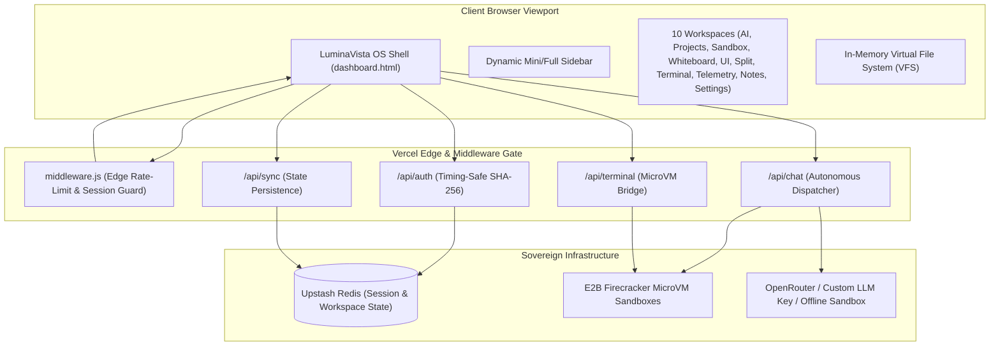

<p align="center">
  
</p>

<h1 align="center">LuminaVista OS — Sovereign Cloud Workspace</h1>

<p align="center">
  <b>A modular, edge-secured web operating system featuring Firecracker MicroVM runtime execution, high-DPI vector canvas whiteboard, collaborative markdown studio, and the multi-step Antigravity Autonomous Agent Studio.</b>
</p>

<p align="center">
  <a href="https://lumina-vista-sigma.vercel.app/"></a>
  
  
  
  
</p>

---

## 🏛️ System Architecture

LuminaVista OS is engineered from the ground up to guarantee sovereign autonomy, zero memory bloat, and sub-millisecond tab switching across 10 specialized workspaces:



---

## ⚡ The 10 Specialized Workspaces

| # | Workspace Tab | Key Technologies | Capabilities |
|---|---|---|---|
| 1 | **ai-llm Studio** | Antigravity Engine, SSE, Markdown AST | Multi-step autonomous agent with live cognitive thinking stream (`Formulating Cognitive Architecture & Verifying MicroVM Playbooks...`), tool execution loop (`SEARCH_WEB`, `VIEW_FILE`, `LIST_DIR`, `WRITE_FILE`, `EDIT_FILE`, `DELETE_FILE`, `EXEC`, `TASK_COMPLETE`), and offline simulation sandbox. |
| 2 | **Projects Explorer** | GitHub Contents API, Responsive Viewports | Scans live repository folders, mounting dynamic web projects with one-click device switcher (Desktop 100%, Tablet 768px, Mobile 375px). |
| 3 | **Compilers & SQL** | E2B Code Interpreter, Python, C++, Java, Bash | MicroVM-backed polyglot code execution with real-time stdout/stderr capture and instant live HTML DOM rendering. |
| 4 | **Whiteboard Pro** | Dual-Canvas Overlay, HiDPI Retina Scaling | Ultra-sharp vector whiteboard with pen, glowing highlighter, line, arrow, rectangle, rounded rectangle, ellipse, sticky notes, fill toggle, and 35-step undo/redo stack. |
| 5 | **UI Generator** | CSS Variables, Color Harmonies, Token Engine | Real-time design token synthesizer, glassmorphism blur generator, padding/radius sliders, and one-click CSS export. |
| 6 | **Split Compare** | Dual Isolated Iframes, Cross-Frame Messaging | Side-by-side A/B viewport testing for design iterations and interactive canvas benchmarks. |
| 7 | **Terminal MicroVM** | Firecracker Linux Kernel, POSIX Shell | Authenticated web terminal dispatching raw commands directly into isolated cloud containers. |
| 8 | **Telemetry** | HTML5 Canvas, Waveform Audio/Metrics Visualizer | 60 FPS real-time animated memory, frame latency, and network throughput telemetry monitors. |
| 9 | **Notes Markdown** | Split-Pane AST Engine, Task Checkbox Sync | Multi-document note vault with tri-mode view (Editor / Split / Preview), word/reading-time metrics, table generation, and bidirectional task checklist updates. |
| 10 | **Settings** | CSS Root Tokens, Theme Engine | Dynamic OS accent palette switching (`cyan`, `emerald`, `amber`, `rose`) with persistent user preferences. |

---

## 🧠 22 Specialized Technical Personas Roster

LuminaVista OS features 22 built-in specialized technical personas dynamically populated from `personas.js`:

1. **Root System Architect**: Distributed infrastructure, backend logic, and microVM containment.
2. **Cybersecurity & Pentest Auditor**: Zero-trust boundaries, input sanitization, and CVE defense.
3. **Senior Full-Stack Engineer**: Modern reactive interfaces and robust serverless APIs.
4. **Staff UI/UX Craftsperson**: Awwwards-grade visual craft, fluid animations, and micro-interactions.
5. **MicroVM & Systems Kernel Specialist**: Firecracker sandboxes, memory safety, and POSIX process control.
6. **Web Quality & WCAG Specialist**: Core Web Vitals (LCP, INP, CLS) and WCAG 2.2 AA accessibility.
7. **Principal Data Scientist**: NumPy, Pandas, analytics, and statistical algorithms.
8. **DevOps & Site Reliability Engineer**: Edge routing, high availability, and CI/CD automation.
9. **High-Throughput Database Architect**: Redis caching, TTL sliding windows, and state synchronization.
10. **Cryptographic Systems Engineer**: Timing-safe hashing, HMAC validation, and cipher suites.
11. **AI Safety & Alignment Researcher**: Constitutional AI guidelines and prompt injection defenses.
12. **Antigravity Autonomous Lead**: Multi-step tool chaining, self-healing code loops, and cognitive planning.
13. **Tailwind CSS & Motion Alchemist**: Utility design tokens, dark-mode palettes, and GSAP orchestrations.
14. **3D Canvas & WebGL Specialist**: Three.js rendering, particle physics, and high-DPI scaling.
15. **REST & Serverless API Architect**: Edge endpoints, OpenAPI specs, and strict payload gates.
16. **Senior QA & Automation Engineer**: Chrome DevTools Protocol automation and regression suites.
17. **Technical Documentation Architect**: Clean architectural RFCs, diagrams, and developer manuals.
18. **Elite SaaS Copywriter**: High-converting developer messaging and polished micro-copy.
19. **Minimalist Hacker**: Pure code and tool directives with zero conversational filler.
20. **Clean Code & Refactor Specialist**: Monolith decomposition, low cognitive complexity, and design patterns.
21. **FinTech & Ledger Architect**: Deterministic calculations, currency precision, and immutable audit trails.
22. **Creative Director**: Aesthetic cohesion, typography scales, and luxury dark-mode visual identity.

---

## 🔒 Hardened Security & Resilience Model

- **Session Security**: 1200-second (20-minute) sliding window sessions enforced in Upstash Redis.
- **Strict Cookie Policy**: `Set-Cookie: godx_session=...; HttpOnly; Secure; SameSite=Strict; Path=/`.
- **Timing-Safe Authentication**: Passwords compared via `crypto.timingSafeEqual` over SHA-256 digests to eliminate timing attacks.
- **Directory Traversal Defense**: All file paths strictly sanitized via `path.posix.normalize` with parent traversal blocks.
- **Zero-Trust State Writes**: `/api/sync` validates active session cookies before allowing mutations to `master_workspace_state`.
- **Autonomous Sandbox Fallback**: If upstream provider keys are unreachable or rate-limited, the system falls back gracefully to local autonomous simulation without interrupting user workflows.

---

## 🧪 Testing & Verification

LuminaVista OS includes both a headless DOM integration suite and a real-browser Chrome DevTools Protocol (CDP) test runner:

```bash
# Run unit & integration test suite (80/80 passing)
npm test

# Run real Google Chrome headless browser verification (22/22 passing)
npm run test:browser

# Boot local mock/development server
npm start
```

---

## 🚀 Deployment

The project deploys natively to **Vercel** with zero build configuration:

1. Link repository to [Vercel](https://vercel.com).
2. Configure Environment Variables in Vercel Project Settings:
   - `ADMIN_PASSWORD`: Master password for OS dashboard access.
   - `UPSTASH_REDIS_REST_URL`: Upstash Redis REST endpoint.
   - `UPSTASH_REDIS_REST_TOKEN`: Upstash Redis REST authentication token.
   - `E2B_API_KEY` (Optional): API key for live Firecracker MicroVM execution.
   - `OLLAMA_API_KEY` (Optional): OpenRouter / LLM gateway API key.
3. Deploy! Changes pushed to `main` trigger automatic production edge releases.

---

<p align="center">
  Developed with craft for <b>LuminaVista OS</b> • Crafted for sovereign cloud computing.
</p>
