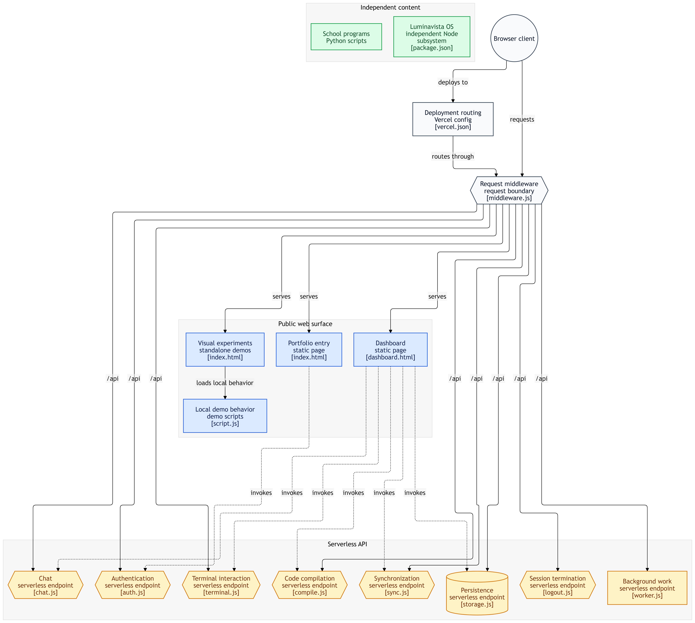
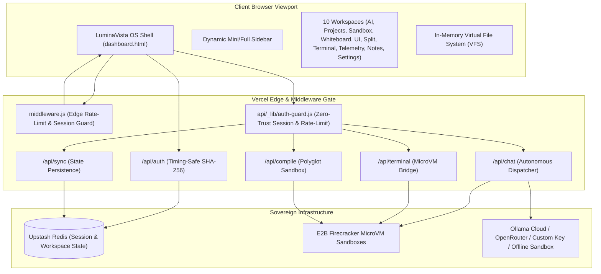

<p align="center">
  
</p>

<h1 align="center">LuminaVista OS — Sovereign Cloud Workspace</h1>

<p align="center">
  <b>A modular, edge-secured web operating system featuring Firecracker MicroVM runtime execution, high-DPI vector canvas whiteboard, collaborative markdown studio, and the multi-step Antigravity Autonomous Agent Studio.</b>
</p>

<p align="center">
  <a href="https://lumina-vista-sigma.vercel.app/"></a>
  
  
  
  
  <a href="./LICENSE"></a>
</p>

---

## 📚 Technical Documentation

| Document | Purpose |
| :--- | :--- |
| **[Architecture Blueprint](docs/ARCHITECTURE.md)** | Full system topology, edge routing, VFS schema, and component layout. |
| **[Security Policy & 10-Persona Audit](docs/SECURITY.md)** | Zero-trust session guard, secret shielding, rate-limiting, and 15m idle auto-lock. |
| **[Production Deployment Guide](docs/DEPLOYMENT.md)** | Step-by-step setup for Vercel, Upstash Redis, E2B microVMs, and Ollama. |

---

## 🏛️ System Architecture

LuminaVista OS is engineered from the ground up to guarantee sovereign autonomy, zero memory bloat, and sub-millisecond tab switching across 10 specialized workspaces:



---

## 📁 Repository Structure

```
LuminaVista/
├── .github/                 # Automated CI/CD workflows and community issue templates
│   ├── workflows/ci.yml     # Automated syntax linting & unit test execution
│   ├── ISSUE_TEMPLATE/      # Structured bug report & feature request templates
│   └── PULL_REQUEST_TEMPLATE.md
├── api/                     # Vercel serverless API functions
│   ├── _lib/                # Shared utilities
│   │   ├── auth-guard.js    # Zero-trust session validation, sliding rate-limits, error sanitizer
│   │   └── redis.js         # Upstash Redis client singleton
│   ├── auth.js              # Constant-time password verification & session issuance
│   ├── chat.js              # Autonomous AI agent dispatch & tool loop
│   ├── compile.js           # Multi-language code compiler via E2B sandbox
│   ├── logout.js            # Session revocation & cookie invalidation
│   ├── storage.js           # GitHub Virtual File System (VFS) synchronization
│   ├── sync.js              # Workspace state persistence in Redis
│   ├── terminal.js          # Linux Firecracker microVM execution engine
│   └── worker.js            # Asynchronous background job worker
├── docs/                    # Technical architecture, security policy, and deployment guides
│   ├── ARCHITECTURE.md      # Detailed system blueprints and specifications
│   ├── DEPLOYMENT.md        # Production environment variable and deployment guide
│   └── SECURITY.md          # 10-persona audit findings and security standards
├── EXM/                     # Interactive workspace projects (19 showcase modules)
├── modules/                 # Modular client-side subsystems
│   ├── ai-studio.js         # Autonomous agent interface, tool loop, simulation sandbox
│   ├── codespace.js         # Artifacts IDE, file tree, code editor, and live DOM preview
│   ├── compiler.js          # Compilers & SQL workbench frontend
│   ├── dashboard.js         # Master bootstrapper and lifecycle manager
│   ├── notes.js             # Markdown note vault with bidirectional checkbox sync
│   ├── projects.js          # Projects explorer & repository showcase inspector
│   ├── sidebar.js           # Responsive sidebar resizer and minimization controller
│   ├── state.js             # Centralized in-memory reactive state manager
│   ├── system.js            # Navigation, command palette, 15m idle auto-lock, and clock
│   ├── telemetry-theme.js   # Waveform canvas visualizer & theme switcher
│   ├── terminal.js          # Quantum Terminal emulator & directive dispatcher
│   └── whiteboard.js        # High-DPI canvas whiteboard with shapes, sticky notes & export
├── tests/                   # Automated quality gates and test runners
│   ├── browser-cdp-test.cjs # Real Google Chrome CDP headless browser test runner
│   ├── features.test.cjs    # DOM integration and security unit test suite
│   ├── lint.cjs             # Syntax validation test runner
│   └── server.cjs           # Local mock development and test server
├── dashboard.html           # Sovereign OS desktop application interface
├── diagram.png              # System architecture showcase diagram
├── index.html               # Biometric security node & entry gateway
├── LICENSE                  # MIT Open-Source License
├── middleware.js            # Edge middleware guarding /dashboard.html
├── package.json             # Manifest, dependencies, and lifecycle scripts
├── personas.js              # 22 enterprise specialized technical personas
└── vercel.json              # CSP headers, HSTS, CORS boundaries, and routing
```

---

## ⚡ The 10 Specialized Workspaces

| # | Workspace Tab | Key Technologies | Capabilities |
|---|---|---|---|
| 1 | **ai-llm Studio** | Antigravity Engine, SSE, Markdown AST | Multi-step autonomous agent with live cognitive thinking stream (`Formulating Cognitive Architecture & Verifying MicroVM Playbooks...`), tool execution loop (`SEARCH_WEB`, `VIEW_FILE`, `LIST_DIR`, `WRITE_FILE`, `EDIT_FILE`, `DELETE_FILE`, `EXEC`, `TASK_COMPLETE`), and offline simulation sandbox. |
| 2 | **Projects Explorer** | GitHub Contents API, Responsive Viewports | Scans live repository folders, mounting dynamic web projects with one-click device switcher (Desktop 100%, Tablet 768px, Mobile 375px). |
| 3 | **Compilers & SQL** | E2B Code Interpreter, Python, C++, Java, Bash | MicroVM-backed polyglot code execution with real-time stdout/stderr capture and instant live HTML DOM rendering. |
| 4 | **Whiteboard Pro** | Dual-Canvas Overlay, HiDPI Retina Scaling | Ultra-sharp vector whiteboard with pen, glowing highlighter, line, arrow, rectangle, rounded rectangle, ellipse, sticky notes, fill toggle, and 35-step undo/redo stack. |
| 5 | **UI Generator** | CSS Custom Properties, Tailwind Engine | Real-time design token generator for padding, border radius, blur, shadows, and color ramps with one-click CSS token export. |
| 6 | **Split Compare** | Dual Isolated Iframes | Side-by-side synchronized iframe comparison across any two workspace projects or external URLs. |
| 7 | **Terminal MicroVM** | E2B Linux MicroVM, WebSockets | Ephemeral bash shell running inside an isolated Linux microVM with real-time process monitoring and bidirectional VFS synchronization. |
| 8 | **Telemetry** | HTML5 Canvas Waveform API | 60 FPS animated audio/compute frequency spectrum with live session latency and memory diagnostics. |
| 9 | **Notes Markdown** | Real-time AST Parser, Tri-View | Multi-document note vault with bidirectional interactive task list syncing (`[x]`), tables, code highlighting, and tri-view mode (Editor / Preview / Split). |
| 10 | **Settings** | CSS Theme Token Injection | Dynamic theme engine (`Cyan`, `Emerald`, `Amber`, `Rose`), local cache flush, and configuration JSON export. |

---

## 🔒 Hardened Security & Resilience Model

- **Zero-Trust API Perimeter**: Centralized [`api/_lib/auth-guard.js`](file:///c:/Users/roysu/LuminaVista/api/_lib/auth-guard.js) enforces session validation (`godx_session`) across all private endpoints (`/api/chat`, `/api/compile`, `/api/terminal`, `/api/storage`, `/api/sync`, `/api/worker`).
- **Secrets Shielding & Error Masking**: `OLLAMA_API_KEY`, `OLLAMA_ENDPOINT`, `ADMIN_PASSWORD`, and `E2B_API_KEY` are kept strictly in server memory. All errors pass through `sanitizeError` to prevent upstream key reflection.
- **Session Security & Sliding Expiration**: 1200-second (20-minute) sliding window sessions enforced in Upstash Redis.
- **15-Minute Client-Side Idle Auto-Lock**: Client-side inactivity detector automatically locks the workspace, blurs `#app-root`, and requires administrator password re-entry.
- **Multi-Tier Rate Limiting**: IP-based sliding rate-limiting in Redis across all compute and stateful endpoints.
- **Strict Cookie Policy**: `Set-Cookie: godx_session=...; HttpOnly; Secure; SameSite=Strict; Path=/`.
- **Timing-Safe Authentication**: Passwords compared via `crypto.timingSafeEqual` over SHA-256 digests to eliminate timing attacks.
- **Enterprise Headers & CSP**: Modern Content-Security-Policy (CSP), HSTS, and origin-isolated CORS configured in [`vercel.json`](file:///c:/Users/roysu/LuminaVista/vercel.json).
- **Directory Traversal Defense**: All file paths strictly sanitized via `path.posix.normalize` with parent traversal blocks.

---

## 🧪 Testing & Verification

LuminaVista OS includes both a headless DOM integration suite and a real-browser Chrome DevTools Protocol (CDP) test runner:

```bash
# Run unit & integration test suite (102/102 passing)
npm test

# Run real Google Chrome headless browser verification (24/24 passing)
npm run test:browser

# Run cross-platform syntax validation lint
npm run lint

# Boot local mock/development server
npm start
```

---

## 🚀 Deployment

The project deploys natively to **Vercel** with zero build configuration:

1. Link repository to [Vercel](https://vercel.com).
2. Configure Environment Variables in Vercel Project Settings (see [docs/DEPLOYMENT.md](docs/DEPLOYMENT.md)).
3. Deploy! Changes pushed to `main` trigger automatic production edge releases.

---

<p align="center">
  Developed with craft for <b>LuminaVista OS</b> • Crafted for sovereign cloud computing.
</p>
